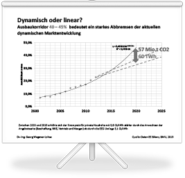

#### 17. April 2014
# EEG-Novelle - noch grundlegender Reformbedarf

314 Seiten füllt der Entwurf eines Gesetzes zur grundlegenden Reform des Erneuerbare-Energien-Gesetzes und zur Änderung weiterer Bestimmungen des Energiewirtschaftsrechts, der vom Bundeskabinett am 8.April verabschiedet wurde. Grundlegend ist daran, dass der dynamische Ausbau der Erneuerbaren Energien durch den Ausbaukorridor (40-45% EE-Strom bis 2025) abgebrochen und konkret um 60 TWh bis 2020 vermindert wird. Die CO2-Bilanz Deutschlands, die ohnehin ihr Einsparziel von 40% bis 2020 kaum noch erreichen kann, wird damit gleichzeitig um 57 Mio. Tonnen weniger entlastet.

Grundlegend ist daran auch, dass im Blick auf eine Europäische Vermittelbarkeit des Deutschen Nachhaltigkeitsweges Ausschreibungsverfahren ab 2017 zum Regelfall der Finanzierungsmechanismen werden sollen, ohne dass es bisher irgendeinen Nachweis für die Kostenwirksdamkeit dieses Verfahrens gibt. Tragisch ist demgegenüber, dass es für den Wunsch deutscher Stromkunden, direkt mit Erneuerbarem Strom beliefert zu werden und das eigene Bezugsverhalten auch partiell, kostenwirksam an die Erzeugungsstrukturen anzupassen, keine neuen Mechanismen gibt sondern nur den Abbruch des sog. Grünstromprivilegs. Eine Vermischung von börsengehandelten, klimabelastenden, fossilen Stromangeboten mit klimaneutralen, erneuerbaren Stromangeboten wird weiter kostentreibend fortgesetzt, ohne zu einer wirklichen Kundenorientierung der erneuerbaren STromerzeugung beizutragen.

Die fluktuierenden Erneuerbaren Energieanlagen PV und Wind sollen wegen ihrer vermeintlich geringen Kosten weiter ausgebaut werden und die Sicherheit schaffende Biostromerzeugung soll  mit einer marginalen Grundvergütung endgültig ausgebremst werden. Die Öffentlichkeit folgt dem Wirtschaftsminister weitestgehend mit Zustimmung und verkennt die Absicherung der Kohleindustrie und die noch weiter erhöhte Entlastung des produzierenden Gewerbes als industriepolitischen Erfolg, der sich aber gegen die Branche der erneuerbaren Energien mit fast 400.000 Arbeitsplätzen und die Strukturentwicklung ländlicher Räume richtet. 

Bereits mit dem EEG 2012 sind maßgebliche Kostensenkungen für die durchschnittliche Einspeisevergütung für neue Anlagen erzielt worden. Das Ziel der Kostenreduzierung von 17 Ct/kWh auf 12 Ct/kWh wurde mit 12,7 Ct/kWh bereits fast erreicht.

In der politischen Auseinandersetzung ist jetzt die Stunde der Abgeordneten angebrochen. Sie müssen entscheiden, ob der Entwurf den Weg in eine sichere erneuerbare Energieversorgung unterstützt. Die Bundesländer haben gegenübner der Bundesregierung bereits weitergehende Interessen aus ihren regionalen Besonderheiten deutlich gemacht und partiell auch durchgesetzt. Die Abgeordneten werden die weitergegangene Reflektion über die Prinzipien der grundlegenden EEG-Reform zur Grundlage ihres Abstimmungsverhaltens machen, dass sich weniger an der politischen Großwetterlage sondern mehr an den Interessen ihrer Wähler vor Ort orientieren sollte. Viele sind bereits Investoren und Nutznießer der neuen dezentralen Form der Energiebereitstellung geworden.

Fakten zur eigenen Information finden Sie hier.

<a href="../_ressources/pdf/eeg_folien.pdf"> Schaubilder:  EEG Basiswissen Die Mythen der EEG Debatte entlarft</a>

