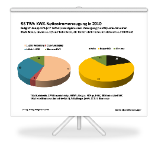

#### 7. Februar 2015
# Mit CO2-Minderung koppeln
## KWK-Novelle zur Deckung der Klimaschutzlücke nutzen

Die aktuelle Debatte zur Novellierung des KWKG ist vor allem von Erwartungen zur Absicherung notleidender Bestandsanlagen und der Ratlosigkeit zur Erfüllung des 25%-Ziels bis 2020 ohne Überschreitung des politisch vereinbarten Kostendeckels von 750 Mio. Euro geprägt. Dabei könnte doch gerade die gekoppelte Wärme- und Stromerzeugung einen wichtigen Beitrag dazu leisten, die 8%-Lücke zur Erfüllung des deutschen Klimaschutzziels (-40% THG bis 2020) zu schließen.

Tatsächlich offenbart sich aktuell bei der einfachen Forderung nach Erhöhung der KWK-Boni unabhängig von Treibhausgasminderungseffekten, welche konzeptionellen Defizite bei der Weiterentwicklung einer marktwirtschaftlichen und umweltfreundlichen Energieversorgung bestehen. Durch immer weiter zunehmende CO2-arme erneuerbare Strommengen verfallen bei den vorhandenen fossilen Überkapazitäten die Börsenpreise immer weiter. Sie sind für den Marktwert des in öffentlichen Anlagen erzeugten KWK-Stroms relevant. CO2-arme KWK-Technologien können damit keine attraktiven Investitionsobjekte mehr darstellen.

Allerdings machen die Analysen der KWK-Studie für das BMWi deutlich, dass über 90% des KWK-Stroms ohne Förderung des KWKG in den Markt gekommen sind und die bescheidenen Fortschritte im Ausbau von KWK-Anlagen in den letzten Jahren zu einem sehr großen Teil nur durch das EEG ermöglicht wurden. Gleichzeitig weisen sie nach, dass die seit 2012 bestehende Förderung von Speichern und Netzen wirksam ist und den Umbau zu einer dezentralen Energiewirtschaft vorantreibt. Bereits in zwei Jahren wird jedoch nur noch Auskömmlichkeit für Heizkraftwerke mit den höchsten spezifischen CO2-Emissionen ermöglicht. Hier ist also zuerst anzusetzen, wenn nicht Marktversagen durch weitere Strompreissteigernde Fördermittel ausgeglichen werden soll.

Die sehr sorgfältige Analyse für die wirtschaftlich möglichen Entwicklungen der öffentlichen KWK auf Basis von Nah- und Fernwärmesystemen zeigt, dass die Erfüllung des 25%-Ziels mit dem Ausbau um 50 TWh (rund 12,5 GW) Strom möglich ist. Die Klimaschonende Wirkung könnte damit um 77 Mio. t CO2 erhöht werden  - also die Klimaschutzlücke fast schließen - und würde innerhalb der Anlagenlebenszeit nicht mit dem EE-Ausbau konkurrieren sondern mehr Systemsicherheit schaffen. Viel stärker sollte dabei noch in den Blick genommen werden, dass KWK-Ausbau ein Beitrag zur Wärmewende ist und mit Wärmespeichern einen preiswerten Ausgleich zu allen teuren Speichervarianten darstellt. Erhöhen lässt sich dieser Effekt, wenn der Ausbau der KWK vor allem mit CO2-ärmeren Energieträgern erfolgt.

Würde also künftig von KWK-Boni ausgegangen, die noch mit der CO2-Minderungswirkung zu multiplizieren sind, statt unabhängig von der Treibhausgaswirkung der verwendeten Brennstoffe zu fördern, könnte der notwendige finanzielle Mehrbedarf für den energiewirtschaftlich mittelfristig notwendigen KWK-Ausbau als Klimaschutzkosten verbucht werden.

<a href="../_ressources/pdf/kwkg_folien.pdf"> Folien:  KWKG Entwicklung</a>

