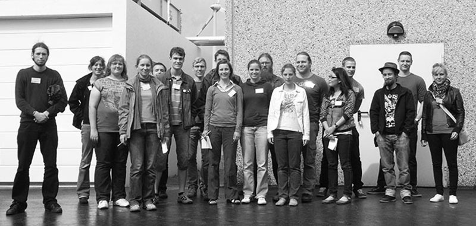
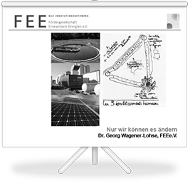

#Bildung

## Vortragstätigkeit für GTZ in China (2012/13)

Die GIZ unterstützt die technische Zusammenarbeit mit China auch im Bereich der effizienten Energienutzung. Das Programm umfasst u.a. die Unterstützung beim Aufbau von Energiedienstleistungsorganisationen und bei der Sanierung und dem Ausbau von Schulen und Krankenhäusern. Zu diesen Themen wurden Vorträge zur Integration von Energieeinsparung und Nutzung erneuerbarer Energien vor Experten der Energie- und Krankenhauswirtschaft gehalten.

## Beratung und Workshops STARK III (2012/13)

Beratung der Landesregierung Sachsen-Anhalt und der kommunalen Antragsteller im Landesprogramm STARK III zu Modellsanierungen öffentlicher Gebäude auf Passivhausstandard mit zwei Workshops. 

Mit Hilf Europäischer Mittel aus der regionalen Wirtschaftsförderung und der ländlichen Entwicklung unterstützt das Land Sachsen-Anhalt seine Kommunen und freien Träger bei der Sanierung von Schulen und Kindereinrichtungen. Das Erreichen hoher Effizienzstandards (kfw 85 und Passivhaus) ist dafür die Grundlage. Die Antragsteller werden bei ihren Ansätzen für eine integrale Planung beraten und die Landesregierung wird bei der Umsetzung des Programms fachlich beraten.

## Vorlesung Erneuerbare Energie (seit 2010)

Vorlesung und Übung zum Thema Erneuerbare Energie an der Brandenburgischen Technischen Universität Cottbus. 

Auf Wunsch von Studenten des Umweltingenieurwesens wurde im Sommersemester 2010 erstmalig eine Vorlesung über das Gesamtgebiet der Erneuerbaren Energien als Wahlpflichtfach für das Bachelorstudium eingerichtet. Es werden die Gebiete Energiestrategien, thermische Solarenergie, Fotovoltaik, fest Biomasse, Biogas, Biokraftstoffe, Windenergie, Wasserkraft, Brennstoffzellen und geothermische Energienutzung einschließlich Wärmepumpen in fachlichen Grundlagen, wirtschaftlichen Bezügen und praktischen Rechnungen dargestellt. Eine Exkursion zu Unternehmen in Brandenburg ergänzt das Angebot.

<a href="../_ressources/pdf/vorlesung_folien.pdf"> Folien:  Vorlesung Erneuerbare Energie  Nur wir können es ändern</a>

