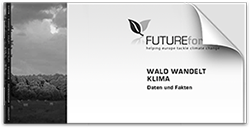

#Broschüren

##"Ohne Bioenergie wird's nichts we(n)den" (2013)

Sieben Leitsätze hat der Bundesverband Bioenergie  für die künftige Nutzung der Bioenergie in Deutschland entwickelt. Sie kennzeichnen die Funktion nachwachsender Rohstoffe und  anfallender Resthölzer. Maximale Effekte für den Klimaschutz sind ein wichtiges Kriterium zur Nutzung begrenzt vorhandener Rohstoffe. Die Leitsätze werden in der dargestellten Broschüre jeweils auch in Bildern präsentiert, für die Konzept und Text entwickelt und mit den Partnerinnen von +C Kommunikationsdesign und Grafikmaschine umgesetzt wurden.

<a href="../_ressources/pdf/bioenergie_broschuere.pdf"> Broschüre:  Leitbild des Bundesverbandes Bioenergie</a>

## Stadtteilzentrum Lichtenrade (2012)

Best-Practice-Projekt Entwicklung Stadtteilzentrum Lichtenrade.

Im Rahmen eines bürgerschaftlichen Engagements für den Berliner Stadtteil Lichtenrade (Tempelhof-Schöneberg) wurden Best-Practice-Beispiele aufgesucht und ausgewertet, um eine im Vollsinn (wirtschaftlich, ökologisch und sozial) nachhaltige Stadtentwicklung mit der Neugestaltung zentraler Flächen und einer Verbesserung der Aufenthaltsqualität (Verkehrsberuhigung) auf der zentralen Einkaufsstraße zu untersetzen.

<a href="../_ressources/pdf/lichtenrade_broschuere.pdf"> Broschüre:  Wege zu einem nachhaltigen Stadtteilzentrum  Bahnhoftraße Berlin-Lichtenrade</a>

## "Looking for the future – initiating change“  (2010)

Auch wenn die europäischen Wälder nach Standorten und klimatischen Bedingungen verschieden sind, brauchen sie einen gemeinsamen Impuls, um dem Klimawandel standhalten zu können. Naturnahe Wälder mit mehr Integration der verschiedenen Funktionen müssen das gemeinsame Ziel von Eigentümern, öffentlichen Forstverwaltungen und engagierten Bürgern werden. Welche Wege dorthin führen, wird im Strategiekapitel des FUTUREforest-Reports beschrieben. 

<a href="../_ressources/pdf/futureforest_report.pdf"> FUTUREforest-Report    Europäische Wälder im Klimawandel ></a>

##Leitbild Forstbetrieb Brandenburg (2011)

Gemeinsam mit dem Forstreferat und der Betriebsleitung von Forst Brandenburg wurde ein Leitbild für den "Wald der Bürgerinnen und Bürger" erarbeitet. Die Hauptziele wurden schriftlich ausgeführt. Das Leitbild trägt der besonderen Verantwortung der öffentlichen Forstverwaltung für die Verbindung von wirtschaftlichen Interessen und ökologischer Verantwortung Rechnung. Eine unterstützende Gestaltung mit poetischen Ergänzungen wurde entwickelt. 

<a href="../_ressources/pdf/waldvision_broschuere.pdf"> Broschüre:  Waldvision 2030  Eine neue Sicht
für den Wald der Bürgerinnen und Bürger</a>

##Wirtschaftsraum Schraden (2011)

Der Wirtschaftsraum Schraden ist eine kleine, aber sehr aktive Region im Süden Brandenburgs an der Grenze zu Sachsen, in der mit Hilfe Europäischer LEADER-Mittel an einer wirtschaftlichen Entwicklung gearbeitet wird. Zum 10-jährigen  Bestehen des gleichnamigen Vereins wurde als Mitglied im Vorstand eine Broschüre entwickelt.

<a href="../_ressources/pdf/schraden_broschuere.pdf"> Broschüre:  10 Jahre Wirtschaftsraum Schraden  was bisher geschah und was wir noch alles vorhaben</a>

##Kompetenznetzwerk Brandenburg (2010)

In einer überraschenden neuen Form wurden die besonderen Kompetenzen Brandenburger Unternehmen im Bereich der Erneuerbaren Energien für eine künftige engere Zusammenarbeit der Länder Berlin und Brandenburg präsentiert.

<a href="../_ressources/pdf/erneuerbarbb_broschuere.pdf"> Broschüre:  Erneuerbar  entwickeln, nutzen, vernetzen in der Hauptstadtregion Berlin-Brandenburg</a>

##Waldprogramm Brandenburg (2010)

Nach fast zwei Jahrzehnten bedurfte das Landeswaldprogramm des Landes Brandenburg im Licht künftiger Herausforderungen einer Überarbeitung. Es wurde gemeinsam mit den Hauptakteuren der Forstwirtschaft aber auch Naturschutzverbänden in Verantwortung des Ministeriums für Infrastruktur und Landwirtschaft erarbeitet und anschließend gestaltet.

<a href="../_ressources/pdf/forestbrandenburg_programme.pdf"> Broschüre:  Waldprogramm 2011  Gemeinsames Handeln zum Schutz und Nutzen ländlicher Naturräume</a>

##Newsletter Energiekompetenz in der Lausitz (2010)

In der Regionalentwicklung der Bergbauregion Lausitz können erneuerbare Energien eine wichtigere Rolle in der Zukunft spielen. Neben den bestimmenden Unternehmen der Energiewirtschaft haben sich in den vergangenen Jahren auch eine ganze Reihe von Unternehmen der neuen Energietechnik in den Bereichen PV, Wind, Solarthermie, Energiemanagement und Bioenergie etabliert. Der Newsletter wurde entwickelt, um auf diese Unternehmen und ihre Bedeutung für die Region sowie engagierte Bürgermeister aufmerksam zu machen.

<a href="../_ressources/pdf/lausitz_newsletter.pdf"> Newsletter:  Neue Energie  Informationen aus der Innovativen Energieregion Lausitz-Spreewald</a>

##Broschüre FUTUREforest (2009)

Der Klimawandel gehört zu den gravierendsten Veränderungen, unter denen in den kommenden Jahren Politik zu gestalten ist. Im Bereich der Waldwirtschaft ist ein dementsprenchendes vorausschauendes Handeln besonders wichtig, weil heutige Entscheidungen auch noch in 80 bis 120 Jahren Bestand haben müssen, wenn ein wirtschaftlicher Erfolg damit verbunden sein soll. Ökologische Wirksamkeit muss damit inhärent verbunden sein. Wälder können aufgrund ihrer Langlebigkeit einen positiven Einfluss auf die Klimaentwicklung nehmen. Zukunft kann also besser oder schlechter gemacht und der Klimawandel kann damit gebremst oder beschleuningt werden. Weil wir hohe Klimaschutzziele erreichen müssen, braucht es naturnähere Forstmanagementmethoden, zu denen das Projekt FUTUREforest in Europa gearbeitet hat. In übersichtlicher Form fasst die Broschüre "Wald wandelt Klima" diese Anforderungen zusammen.

<a href="../_ressources/pdf/futureforest_broschuere.pdf"> Broschüre:  Wald wandelt Klima  Daten und Fakten</a>

