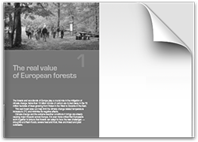
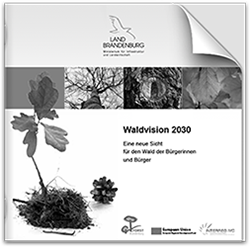

#Broschüren

##Broschüre BBE-Leitbild (2013)

In einem Zielgruppenorientierten Design werden die Grundlagen für die künftige Bioenergienutzung dargestellt und die sieben Leitsätze des BBE präsentiert.

<a href="../_ressources/pdf/bioenergie_broschuere.pdf"> Broschüre:  Ohne Bioenergie wird’s nichts we(n)den</a>

## Stadtteilzentrum Lichtenrade (2012)

Best-Practice-Projekt Entwicklung Stadtteilzentrum Lichtenrade. 

Im Rahmen eines bürgerschaftlichen Engagements für den Berliner Stadtteil Lichtenrade (Tempelhof-Schöneberg) wurden Best-Practice-Beispiele aufgesucht und ausgewertet, um eine im Vollsinn (wirtschaftlich, ökologisch und sozial) nachhaltige Stadtentwicklung mit der Neugestaltung zentraler Flächen und einer Verbesserung der Aufenthaltsqualität (Verkehrsberuhigung) auf der zentralen Einkaufsstraße zu untersetzen.

<a href="../_ressources/pdf/lichtenrade_broschuere.pdf"> Broschüre:  Wege zu einem nachhaltigen Stadtteilzentrum  Bahnhoftraße Berlin-Lichtenrade</a>

## FUTUREforest-Broschüre Europäische Wälder im Klimawandel (2010)

Strategiekapitel zur FUTUREforest-Broschüre Europäische Wälder im Klimawandel. 

<a href="../_ressources/pdf/futureforest_report.pdf"> Report:  Looking for the future  initiating change</a>

##Leitbild Forstbetrieb Brandenburg (2011)

Erarbeitung eines Leitbildes und Gestaltung der Veröffentlichung für den Forstbetrieb Brandenburg. 

<a href="../_ressources/pdf/waldvision_broschuere.pdf"> Broschüre:  Waldvision 2030  Eine neue Sicht
für den Wald der Bürgerinnen und Bürger</a>

##Broschüre Wirtschaftsraum Schraden (2011)

Der Wirtschaftsraum Schraden ist eine kleine, aber sehr aktive Region im Süden Brandenburgs an der Grenze zu Sachsen, in der mit Hilfe Europäischer LEADER-Mittel an einer wirtschaftlichen Entwicklung gearbeitet wird. Zum 10-jährigen  Bestehen des gleichnamigen Vereins wurde als Mitglied im Vorstand eine Broschüre entwickelt.

<a href="../_ressources/pdf/schraden_broschuere.pdf"> Broschüre:  10 Jahre Wirtschaftsraum Schraden  was bisher geschah und was wir noch alles vorhaben</a>

##Broschüre Kompetenznetzwerk Brandenburg (2010)

In einer überraschenden neuen Form wurden die besonderen Kompetenzen Brandenburger Unternehmen im Bereich der Erneuerbaren Energien für eine künftige engere Zusammenarbeit der Länder Berlin und Brandenburg präsentiert.

<a href="../_ressources/pdf/erneuerbarbb_broschuere.pdf"> Broschüre:  Erneuerbar  entwickeln, nutzen, vernetzen in der Hauptstadtregion Berlin-Brandenburg</a>

##Waldprogramm Brandenburg (2010)

XX

<a href="../_ressources/pdf/forestbrandenburg_programme.pdf"> Broschüre:  Forest Programme 2011  Joint action for the protection and the benefit of rural landscapes</a>

##Newsletter Energiekompetenz in der Lausitz (2010)

In der Regionalentwicklung der Bergbauregion Lausitz können erneuerbare Energien eine wichtigere Rolle in der Zukunft spielen. Neben den bestimmenden Unternehmen der Energiewirtschaft haben sich in den vergangenen Jahren auch eine ganze Reihe von Unternehmen der neuen Energietechnik in den Bereichen PV, Wind, Solarthermie, Energiemanagement und Bioenergie etabliert. Der Newsletter wurde entwickelt, um auf diese Unternehmen und ihre Bedeutung für die Region sowie engagierte Bürgermeister aufmerksam zu machen.

<a href="../_ressources/pdf/lausitz_newsletter.pdf"> Newsletter:  Neue Energie  Informationen aus der Innovativen Energieregion Lausitz-Spreewald</a>

##Broschüre FUTUREforests (2009)

XX

<a href="../_ressources/pdf/futureforest_broschuere.pdf"> Broschüre:  Wald wandelt Klima  Daten und Fakten</a>

