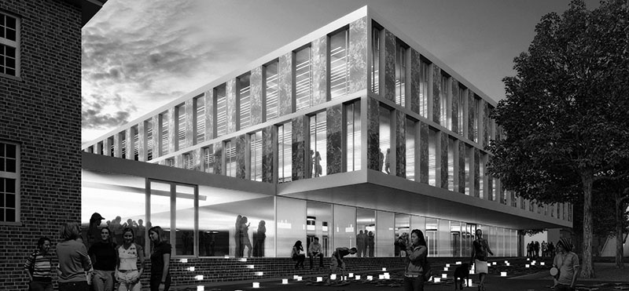

# Konzepte

## Workshop Energiekonzeption Berlin Buch (2012)

Vorbereitende Überlegungen zu einer Energiekonzeption für den Gesundheitsstandort Berlin Buch mit einem Workshop.

Durch eine komplexe Neugestaltung sollen die Wärme-, Strom- und Kälteversorgung des Gesundheitscampus und des Stadtteils Berlin Buch unter Minimierung des Energieeinsatzes integriert werden

<a href="../_ressources/pdf/buch_folien.pdf"> Folien:  Berlin Buch  Green Campus</a>

## Energiekonzept Lohberg, Dinslaken (2011)

Energiekonzept für den Zechenstandort Lohberg, Dinslaken. 

Für die Entwicklung des ehemaligen Zechenstandorts zu einem Beispiel für nachhaltiges Wohnen und Arbeiten wurden Konzepte für eine Minimierung des Energieeinsatzes und die vollständige Versorgung mit erneuerbaren Energien mit Bezug zur Versorgung der angrenzenden Gartenstadt auf der Basis von Fotovoltaik und Wärmepumpen aufgezeigt.

<a href="../_ressources/pdf/lohberg_konzept.pdf"> Energiekonzept:  Lohberg 2.0 Kreativ Quartier Lohberg</a>

## Wettbewerb „Neue Kaue“ Lohberg (2012)

Fachgutachter zum Wettbewerb „Neue Kaue“ Lohberg. 

Das Energiekonzept für den Zechenstandort bildete die Grundlage für einen beschränkten Wettbewerb unter fünf Architekturbüros für das erste Modellgebäude am Standort der alten Kaue, aus dem Bob Gysin und Partner, Zürich, als Gewinner hervorgingen.

## Klimaschutzkonzept Wachstumskern O-H-V  (2010)

Klimaschutzkonzept für den regionalen Wachstumskern Oranienburg-Hennigsdorf-Velten. 

Für die nördlich von Berlin gelegenen Städte Oranienburg, Hennigsdorf und Velten wurde ein Klimaschutzkonzept im Rahmen der Förderung des Bundesumweltministeriums erarbeitet, dass zur Positionierung des regionalen Wachstumskerns in einer nachhaltigen Entwicklung beigetragen hat.

<a href="../_ressources/pdf/ohv_folien.pdf"> Folien:  Klimaschutzkonzept des Regionalen Wachstumskerns Oranienburg-Hennigsdorf-Velten und Klimafreundliches Fernwärmekonzept Hennigsdorf</a>

## Energiestrategie Landkreis OSL (2010)

Umsetzung der Energiestrategie des Landes Brandenburg im Landkreis Oberspreewald Lausit.

Auf der Basis der Energiestrategie des Landes Brandenburg konnte in einer Analyse aller Potenziale für die Nutzung erneuerbarer Energieträger aufgezeigt werden, wie bei Abnahme des Energiebedarfs in Industrie, Gebäuden und Verkehr eine 25% CO2-Minderung bis 2020 erreicht werden kann.

<a href="../_ressources/pdf/osl_folien.pdf"> Folien:  Umsetzung Energiestrategie 2020 Landkreis Oberspreewald Lausit</a>

## FUTUREforest Game (2010)

Inhaltliches und grafisches Konzept für ein PC-Spiel zur Simulation der Entwicklung europäischer Wälder im Klimawandel auf der Basis des Sensitivitätsmodells von Frederic Vester. 

In Zusammenarbeit mit Malik-Management wurden aus der Arbeit des FUTUREforest-Projektes 11 Variablen abgeleitet, die die Entwicklung Europäischer Wälder beeinflussen. In einem dynamischen Systemmodell wurden diese Variablen abgebildet und zu einem Spiel verarbeitet, dessen grafische Oberfläche gemeinsam entwickelt wurde.

<a href="../_ressources/pdf/MISSING"> Computerspiel:  FUTUREforestGAME  something</a>

