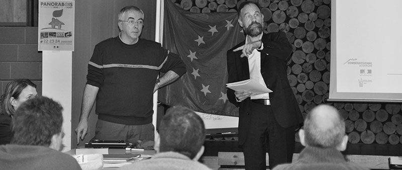
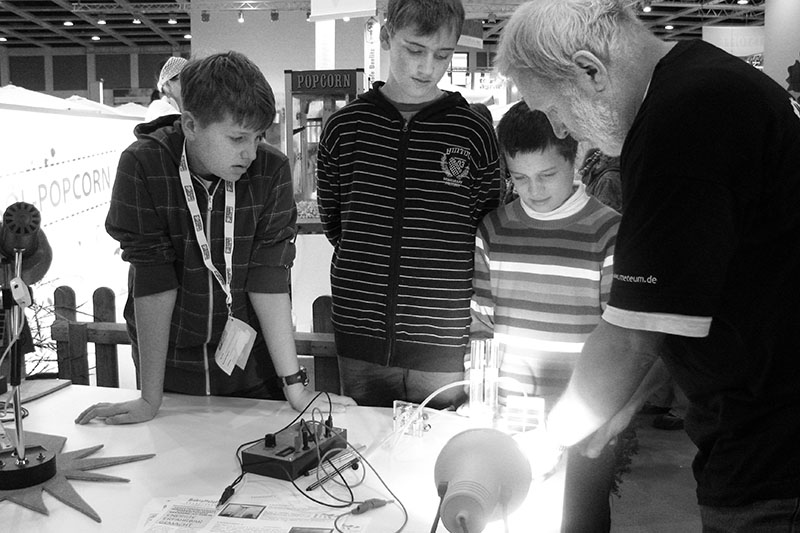

#Management

## Management FUTUREforest (2008-2011)

Management des Interreg IVc-Projektes FUTUREforest für das Brandenburger Ministerium für Infrastruktur und Landwirtschaft mit Forstorganisationen und staatlichen Verwaltungen in der Auvergne,Brandenburg, Bulgarien, Katalonien, Lettland, Ost-Slovakei und Wales.

Unter den Veränderungen des Klimawandels kommt es in vielen Regionen Europas zu Verschiebungen der Niederschlags- und Temperaturmuster, die auch die Lebensräume der Ökosysteme Wald beeinflussen. FUTUREforest untersuchte die Erfahrungen der beteiligten Forstverwaltungen/Regionen und ihre waldbaulichen und politischen Strategien für eine nachhaltige Waldwirtschaft. Das projekt wurde im September 2010 im Rahmen der Europäischen Konferenz zum int. Jahr der Wälder im Europäischen Parlament abgeschlossen.

## Kompetenznetzwerk Mineralölwirtschaft / Biokraftstoffe Brandenburg (2008-2010)

Im Rahmen der Mineralölsteuerbefreiung für Biokraftstoffe kam es auch in Brandenburg zu einem starken Aufbau der Biokraftstoffindustrie für die Biodiesel- und BioEthanol-Produktion. Das Land Brandenburg sorgte im Rahmen seiner Wirtschaftsstrategie für eine Vernetzung der bestimmenden Branchen und bot auch der Mineralölwirtschaft und Biokraftstoffindustrie eine solche Möglichkeit. Mit Studien, Workshops, PR-Maßnahmen und Veranstaltungen wurde zur Zusammenarbeit der Unternehmen und Information der Abnehmer zusammengearbeitet.

##Moderation Biomasseaktionsplan Brandenburg (2010)

Zur Umsetzung der Europäischen Biomassestrategie wurden nationale Biomasseaktionspläne erarbeitet, die auch in den Bundesländern eine Untersetzung erfahren haben. Als Land mit starker Landwirtschaft und einer auf Nachhaltigkeit ausgerichteten Energiepolitik hatte Brandenburg das Ziel die verfügbaren Bioenergiepotenziale neben einer auskömmlichen Versorgung der Gesamtregion mit Nahrungs- und Futtermitteln zu analysieren. Lediglich 0,1 ha je Kopf werden dafür benötigt, obwohl 0,2 ha/Kopf als Acker- und Grünlandfläche zur Verfügung stehen. Damit besteht noch ein Ausbaupotenzial für Biogasanlagen. Die Workshops zur Ableitung der Brandenburger Strategie wurden im Rahmen des Kompetenznetzwerks Biokraftstoffe moderiert
