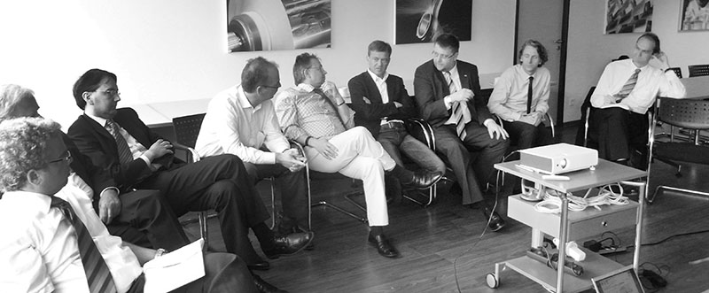
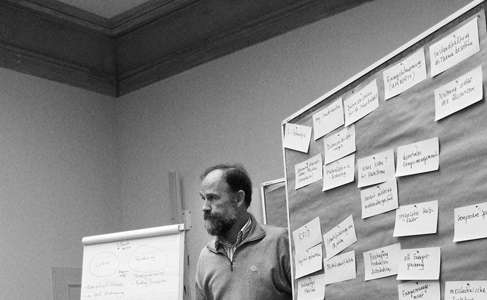

#Studien

## Strategieprojekt Bundesverband Bioenergie (2012)

Strategieprojekt Positionierung der Bioenergie für den Bundesverband Bioenergie zur künftigen Positionierung. 

In Auswertung vorhandener Studien zu den Biomassepotenzialen Deutschlands und ihrer Nutzung wurde in zwei Workshops mit dem Vorstand und den Mitgliedern eine Kurzstudie erarbeitet, die die Grundlage für sieben Thesen zur künftigen Ausrichtung der Bioenergienutzung in Deutschland bildet.

## Strategie Bioenergie im Strom- und Wärmemarkt (2013)

Aufbauend auf der Kompass-Studie des Instituts für Zukunftsenergiesysteme, Saarbrücken, für den Bundesverband Erneuerbare Energien im Rahmen der Transformationsplattform wurden Überlegungen zur Neuausrichtung des Marktdesigns für die Biomassenutzung zu einer kontinuierlichen Stromversorgung in Verbindung zum Wärmemarkt angestellt.

## Strategieberatung TH Wildau (2011/12)

Strategieberatung für die Technische Hochschule Wildau zur Herausbildung eines spezifischen Energieprofils in Lehre und Forschung mit drei Workshops.

Zur Herausbildung eines eigenen Profils im Bereich der Ausbildung und Forschung der Hochschule wurde der Fokus Energiesystemmanagement mit den Professoren gemeinsam entwickelt.

## Masterplan Bioenergiezentrum Großbeuthen (2010)

Zur Aus- und Weiterbildung von Landwirten, Betreibern und Ingenieurbüros wurde ein Masterplan für den Aufbau eines Zentrums auf dem Gutshof in Großbeuthen entwickelt.

## Beiträge Biomasseaktionsplan Brandenburg (2010)

Gemeinsam mit allen wichtigen Akteuren aus dem Bereich der Landesregierung Brandenburg, der Landwirtschaft, der Forschung und Branchenvertretern wurden die Grundlagen zur künftigen Nutzung der Bioenergie im Land Brandenburg erarbeitet und für eine Broschüre aufbereitet.
